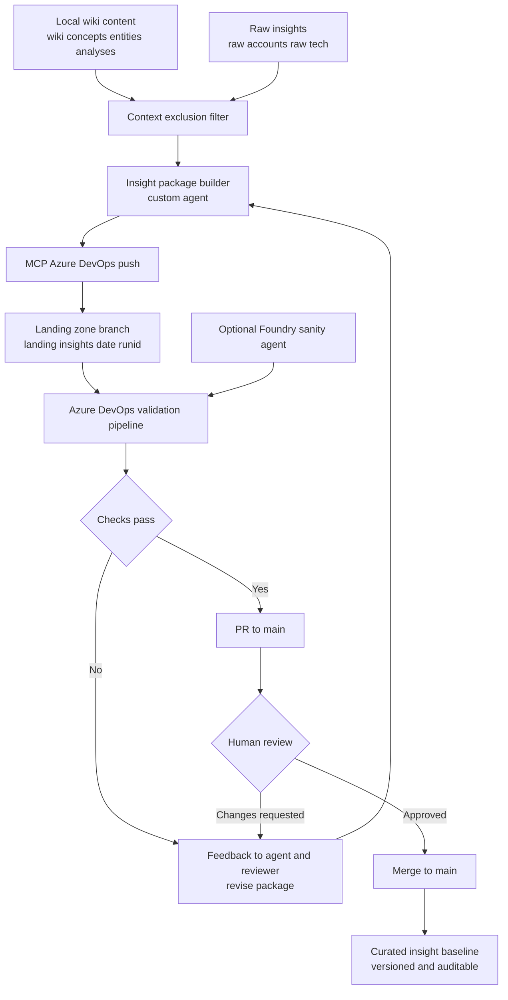

# Analysis: Azure DevOps Insights Governance Model

## Objective

Design a practical operating model where:

- Azure DevOps is the central system of record for insight assets.
- Local `wiki/` remains the active working context for interaction-time synthesis.
- `raw/` stores account and technical insights with auditable version control.
- A custom agent pushes curated outputs through MCP into a non-main landing zone branch.
- Promotion to main is gated by review and sanity checks (human + automated agent checks).

## Proposed Architecture

1. **Working layer (`wiki/`)**
- Agents and users iterate in `wiki/`.
- A context-exclusion policy removes non-essential pages (stale analyses, drafts, duplicated snippets) before packaging.

2. **Evidence layer (`raw/`)**
- `raw/accounts/` for account insights.
- `raw/tech/` (new folder) for technical insights and solution patterns.
- Files are immutable by default: prefer append/new file over overwrite.

3. **Control layer (Azure DevOps Repos + Pipelines)**
- `main`: curated, approved insight baseline.
- `landing/insights-*`: agent-generated staging branches for review.
- Optional `release/insights-*`: batched promotion branches for monthly or milestone publication.

4. **Agent layer (Custom agent + MCP + optional Foundry sanity agent)**
- Custom agent composes candidate insights from `wiki/` + selected `raw/` references.
- MCP server pushes to Azure DevOps landing branch, opens PR to `main`.
- Optional Foundry-based reviewer agent scores quality, duplication, and policy compliance.

## Context Exclusion Mechanism

Use a deterministic exclusion config before packaging insights to landing branch.

Example policy:

- Include:
  - `wiki/concepts/**`
  - `wiki/entities/**`
  - `wiki/analyses/**` where `updated <= 30 days`
  - `raw/accounts/**`
  - `raw/tech/**`
- Exclude:
  - `wiki/log.md`
  - `wiki/overview.md` (optional for compact push)
  - `wiki/analyses/**` tagged `draft` or `low-confidence`
  - Files failing metadata checks (missing title/type/sources in frontmatter)

Minimum metadata gate:

- Required frontmatter: `title`, `type`, `updated`, `sources`, `tags`.
- Confidence label in body: `High`, `Medium`, or `Low`.
- Contradiction block when evidence is conflicting.

## Version Control Model for `raw/`

Use these conventions to preserve history and traceability.

1. **Immutable record strategy**
- Do not edit historical insight files except metadata corrections.
- Add new files with timestamp or revision suffix.

2. **Naming strategy**
- `raw/accounts/<account>-insight-YYYY-MM-DD.md`
- `raw/tech/<topic>-insight-YYYY-MM-DD.md`
- For refinements: `...-r2.md`, `...-r3.md`

3. **Manifest and lineage**
- Maintain `raw/sources.md` as manifest.
- Add `supersedes:` and `superseded_by:` fields in frontmatter for lineage.

4. **Branch protection**
- Block direct pushes to `main`.
- Require PR review + passing validation pipeline for promotion.

## Promotion Workflow (Landing Zone -> Main)

1. Local agent run produces insight package from allowed `wiki/` + `raw/` scope.
2. MCP push creates `landing/insights-<date>-<runid>` branch in Azure DevOps.
3. Validation pipeline runs:
- Schema/frontmatter checks
- Duplicate-content detection
- PII and secret scan
- Link integrity and source-reference checks
- Optional Foundry sanity scoring
4. PR created from landing branch to `main`.
5. Reviewer approves/rejects with comments.
6. Merge to `main` only when checks pass and reviewer approves.

## Flow Diagram

## Recommended Implementation Backlog

1. Add `raw/tech/` and seed with first technical insight files.
2. Add exclusion config file: `.insights/exclusion-policy.yml`.
3. Add validation script: `.insights/validate-insights.ps1`.
4. Add Azure DevOps pipeline for landing branch validation.
5. Add branch policies for `main` and `landing/*`.
6. Add custom agent command: `publish-insights` using MCP push.
7. Add optional Foundry evaluator step for sanity score threshold.

## Governance Notes

- Keep `wiki/` as your fast interaction and synthesis workspace.
- Treat `raw/` as evidence-grade and auditable historical layer.
- Treat Azure DevOps `main` as the approved productized knowledge baseline.
- Treat landing branches as the controlled quarantine/staging lane.

## Success Criteria

- Every promoted insight has lineage to a raw evidence source.
- No direct write path from local working context to `main`.
- Promotion lead time is low, but governance quality remains high.
- Historical snapshots of account and tech insights are reproducible.
